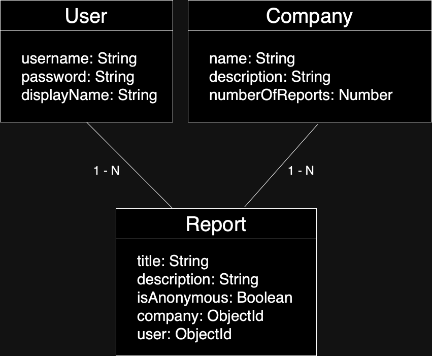

# Company Reporting System

List of REST APIs for a platform where you can complain about companies. Most of the companies these days don't work properly. If you want to complain, you can use this platform.
 
📘 This project is developed for educational purposes and you can learn the following features.
 

# Features

- ExpressJS with Typescript
- MongoDB schema design, schema relation and CRUD operations
- JWT authentication
- Layered architecture
- Custom type definitions

# List of APIs

- Authentication
  - Login
  - Register
- Company
  - Get companies
  - Get single company
  - Add new company
  - Update company
  - Delelete company
- Report
  - Get reports
  - Get reports by company id
  - Get reports by user id
  - Add new report
  - Update report
  - Delete report

# MongoDB Schema Design

The database consists of three tables.

- User
- Company
- Report

  

